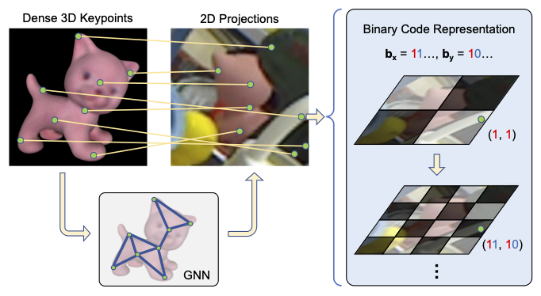

# CheckerPose

The implementation of the paper 'CheckerPose: Progressive Dense Keypoint Localization for Object Pose Estimation with Graph Neural Network' (ICCV2023). [`ArXiv`](https://arxiv.org/abs/2303.16874)




## System Requirement
### Tested Environment
- Ubuntu 18.04
- CUDA 11.1
- Python 3.6

### Main Dependencies:
- [`bop_toolkit`](https://github.com/thodan/bop_toolkit)
- Pytorch 1.9
- torchvision 0.10.0
- opencv-python
- [`Progressive-X`](https://github.com/danini/progressive-x)


## Data preparation
1. Download the dataset from [`BOP benchmark`](https://bop.felk.cvut.cz/datasets/)

2. For LM dataset, please download additional data following [`GDR-Net`](https://github.com/THU-DA-6D-Pose-Group/GDR-Net#datasets)

3. We use farthest point sampling (FPS) method to obtain the dense keypoints. We provide the sampled results in `checkerpose/datasets/BOP_DATASETS/(dataset_name)/fps_202212`. We also provide the source codes in `checkerpose/preprocess_data` to generate the results:
```
python get_fps_points.py -dataset lmo -npoint_log2 12
```
The generated FPS points will be saved to `fps_202212` folder of the corresponding dataset, e.g. `lmo/fps_202212`. The `.pkl` file saves three keys: `npoint`, `id`, and `xyz` (unit is mm). 

4. The expected data structure: 
    ```
    checkerpose/datasets/
    ├── BOP_DATASETS/
        ├── lm
        ├── lmo   
        └── ycbv/
            ├── fps_202212
            ├── models
            ├── models_eval
            ├── models_fine
            ├── test
            ├── train_pbr
            ├── train_real
            └── ...               #(other files from BOP page)
    ├── lm_imgn  # the OpenGL rendered images for LM, 1k/obj
    ├── VOCdevkit  # background images, used only in LM
    ```

5. Download the 3 [`pretrained resnet`](https://cloud.dfki.de/owncloud/index.php/s/zT7z7c3e666mJTW) provided by [`ZebraPose`](https://github.com/suyz526/ZebraPose), save them under `checkerpose/pretrained_backbone/resnet`. 

6. (Optional) We use `checkerpose/preprocess_data/get_overall_visibility.py` to compute the self-occlusion measure discussed in Section 3.5. 

7. Since our binary codes are computed online, there is no need to produce additional ground truth data for training.

## Pretrain
1. For LMO dataset, adjust the paths in the config files, and pretrain the part that generates the low level bits with `pretrain.py`, e.g.

`python pretrain.py --cfg config/lmo/init_gnn2_hrnetw18_npt512.txt --obj_name ape`

2. For YCBV dataset, use `convert_cfg_lmo_to_ycbv.py` to convert the configs from LMO dataset, e.g.

`python convert_cfg_lmo_to_ycbv.py -cfg init_gnn2_hrnetw18_npt512`

And then run `pretrain.py` similar to LMO.

3. For LM dataset, since we train a single pose estimator for all 13 objects, we use a modified script to pretrain:

`python pretrain_lm.py --cfg config/lm/init_gnn2_hrnetw18_npt512_lm.txt`

## Training

(update 2023/09/04) we upload the trained models in [Google Drive](https://drive.google.com/drive/folders/1b5NQie-WNe_4LhYxqvbE35FaCTXzF9tB?usp=sharing). 

1. For LMO dataset, adjust the paths in the config files, and train the network with `train.py`, e.g.

`python train.py --cfg config/lmo/hr18GNN2_res6_gnn3Skip_mlpQuery.txt --obj_name ape`

The script will save the last 3 checkpoints and the best checkpoint, as well as tensorboard log. 

2. For YCBV dataset, use `convert_cfg_lmo_to_ycbv.py` to convert the configs from LMO dataset, e.g.

`python convert_cfg_lmo_to_ycbv.py -cfg hr18GNN2_res6_gnn3Skip_mlpQuery`

And then run `train.py` similar to LMO.

3. For LM dataset, since we train a single pose estimator for all 13 objects, we use a modified script to train:

`python train_lm.py --cfg config/lm/hr18GNN2_res6_gnn3Skip_mlpQuery_lm.txt`

## Test with trained model

(update 2023/09/04) we upload the trained models in [Google Drive](https://drive.google.com/drive/folders/1b5NQie-WNe_4LhYxqvbE35FaCTXzF9tB?usp=sharing).

For LMO/YCBV, run 

`python test.py --cfg config/lmo/hr18GNN2_res6_gnn3Skip_mlpQuery.txt --obj_name ape --ckpt_file path/to/the/best/checkpoint --eval_output_path path/to/save/the/evaluation/report --use_progressivex`

For LM, run

`python test_lm.py --cfg config/lm/hr18GNN2_res6_gnn3Skip_mlpQuery_lm.txt --ckpt_file path/to/the/best/checkpoint --eval_output_path path/to/save/the/evaluation/report --use_progressivex`

## Acknowledgement
Some code are adapted from [`Pix2Pose`](https://github.com/kirumang/Pix2Pose), [`SingleShotPose`](https://github.com/microsoft/singleshotpose), [`GDR-Net`](https://github.com/THU-DA-6D-Pose-Group/GDR-Net), and [`ZebraPose`](https://github.com/suyz526/ZebraPose).

## Citation
```
@article{lian2023checkerpose,
  title={CheckerPose: Progressive Dense Keypoint Localization for Object Pose Estimation with Graph Neural Network},
  author={Lian, Ruyi and Ling, Haibin},
  journal={arXiv preprint arXiv:2303.16874},
  year={2023}
}
```
